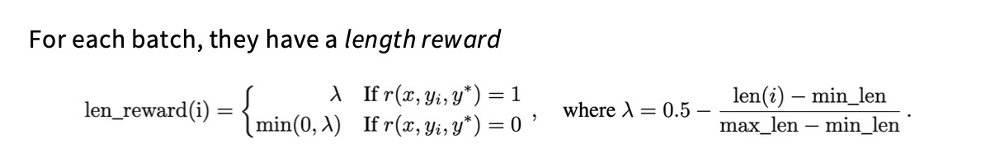

## GRPO

PPO很难实现，并且value model和policy model一样大，就GPU内存而言，需要支付语言模型的两倍成本。

DPO适合成对比较，但数据并不是天然成对的，DPO更多像一种离线（offline）的策略，算法完全依赖于一个固定的、预先收集好的数据集进行训练。在整个训练过程中，它不会与环境产生任何新的交互，也不会生成任何新的数据。它只能从已有的数据中“榨取”知识。

关于KL散度计算，这里与传统的KL散度计算方式有一点不一样。

> 我们对这个量求期望时，是从策略 $\pi_{\theta}$ 的分布中进行采样来计算的。也就是说，我们要计算的是$E_{o ∼ \pi_{\theta}}[D_{KL}] = E_{o ∼ \pi_{\theta}}[log \frac{\pi_{ref}(o | q)}{\pi_{\theta}(o | q)}]$，推导比较简单。我们发现这正是标准KL散度的定义。所以这个公式是一个为KL散度构建的**单点采样估计量**，虽然对于单个样本 $o_i$ 来说，它的值不等于标准KL散度，但它在期望的意义上是和标准KL散度完全等价的。在强化学习中，我们通常使用小批量样本来估计期望值，上面的方法也可以理解为一种降低方差的技巧。
>
> 从另一方面，令比值$x = \frac{\pi_{ref}(o | q)}{\pi_{\theta}(o | q)}$，$f(x) = x - log(x) - 1$，$f(1) = 0$，这意味着当新旧策略对同一个输出的概率判断一致时，惩罚为0。当$x != 1$时，$f(x) > 0$，即两个策略的概率差异越大，这个惩罚项的值就越大。

我们来看上面一个GRPO的实现。

* 难度偏见：当问题太难或者太容易的时候，奖励要么都是0，要么都是1，其奖励的标准差会很小。根据公式，一个很小的分母会导致梯度变得非常大，这使得模型会过度关注这些“极端”问题，而忽略了正常难度的问题。 

* 长度偏见：因为除以了$|o_i|$，模型从简短、正确的回答中获得了更强的正向激励。久而久之，模型就学会了：在有把握答对的时候，尽量说得简短。 模型因为给出了一个又长又错的回答，受到的惩罚反而变得非常小。模型就学到了一个“钻空子”的策略：当我不确定答案时，就通过说一长串模棱两可、不知所云的废话来“稀释”惩罚。

所以这就有了一种Dr.GRPO版本的实现。

## Case Study

### DeepSeek R1

RL step为什么要加上语言一致性损失？

在思维链种会出现语言混合，模型确实有语言混合的自然倾向，加上这项损失有利于保持在单一语言内。

最后有一些不太成功的尝试，探索了两种在其他领域非常成功的方法——**PRM** 和 **MCTS**。

* PRM（Process Reward Model）：对模型解决问题的每一个中间步骤都进行打分和奖励。
* MCTS (蒙特卡洛树搜索)：将问题的解空间构建成一棵“树”，然后通过模拟（“推演”）来系统性地探索这棵树，找到最优的解决路径。

### KIMI K1.5

**Data curation**

1. 确保数据集覆盖范围广泛且均衡。
2. 排除选择题/判断题，这类题目容易出现假阳性。也就是说，模型可能仅仅靠“猜”或者利用选项中的某些统计规律就选对了答案。
3. 只选择模型自己都会做错的难题。对于每一个候选问题，让一个已经经过 SFT 微调的模型，在“高创造性模式”（high sampling temperature，意味着答案会更多样、更随机）下，生成 10 个不同的答案。选择那些“通过率”很低（即模型很难答对）的题目进入最终的训练集。

CoT长度会带来推理成本，Kimi不再鼓励过长的CoT。引入了长度奖励机制，（如果在早期就加入这个奖励反而会阻碍强化学习的进展）。

答案正确$r = 1$：

* 一个简短的答案(`λ > 0`) 会得到一个正的长度奖励。
* 一个冗长的答案(`λ < 0`) 会得到一个负的长度奖励。

答案错误$r=0$：

* 一个简短的错误答案 (`λ > 0`)，`min(0, λ)` 的结果是 `0`。模型不会因为“答错得短”而受到额外的长度惩罚。
* 一个冗长的错误答案 (`λ < 0`)，`min(0, λ)` 的结果是 `λ` (一个负数)。这意味着模型不仅要因为“答错”受罚，还要因为“答错得又臭又长”而受到额外的长度惩罚。

**RL Setup**

### Qwen 3

什么是思维模式融合（Thinking Mode Fusion）？

通过一种精巧的“标签化”方法，让模型能够显式地、可控地进行“思考”，并且可以根据需要控制其思考过程的长度（即思维链 CoT 的长度）。

1. 混合使用“思考”与“不思考”的数据，并用标签区分。思考模式用一对 `<think>` 和 `</think>` 标签把完整的、一步一步的推理过程（思维链）包裹起来。推理过程结束后，再给出最终的答案 `{response}`。

2. 通过特殊字符串实现提前终止，防止模型在生成思维链的过程中无限地写下去。一旦长度超过了预设的“预算”或阈值，系统会强行中断模型的生成过程。这种“被中途打断后依然能总结并回答”的能力，并不是专门训练的，而是应用了 Thinking Mode Fusion 后自然涌现出来的能力。

在进行推理时，`<think>` 标签是模型输出的一部分，而不是用户输入的一部分。

