## Standard Self-Attention

标准的Self-Attention如下：
$$
O=softmax(QK^T)V
$$
其中$Q, K, V, O$都是2D矩阵，shape为[seq_len, head_dim]，把上述公式展开，可以得到一个3-pass的Self-Attention计算步骤。具体如下：
$$
S = QK^T, (N\times N) \\
P=softmax(S),(N\times N) \\
O=PV,(N\times d)
$$
3-pass的算法中，步骤一和步骤二，会分别产生两个中间矩阵$S$和$P$，内存需求均是$O(N^2)$。

矩阵乘法具有分块和累加的特性，一个大的矩阵乘法，可以通过Tiling技术，分成小块的可以在片上计算的矩阵乘法，然后通过将各个分块矩阵乘的结果进行累加获得最后的正确结果。如下图所示，$C=AB$，$C$中的第$i$行第$j$列的分块$C[i][j]$等于矩阵$A$第$i$行的每一个分块乘以矩阵$B$第$j$列的每一个分块，再把结果相加

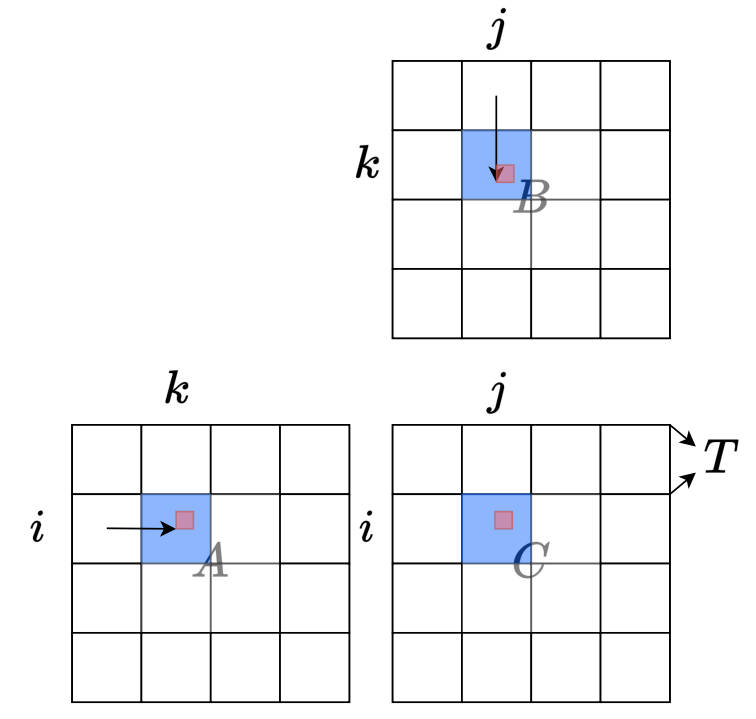

但是Softmax计算没有这种累加性，它依赖于一个全局的分母项。FlashAttention和online softmax想解决的核心问题，正是如何将算法本身从这个全局的依赖中解耦，从而可以使用Tiling进行快速的片上计算。从结果上来看，相对于原始的3-pass算法，online-softmax是2-pass算法，而FlashAttention是1-pass算法。

接下来，本文将从online-softmax开始，逐步讲解FlashAttention算法。

### （Safe）Softmax:3-pass

safe-softmax主要是为了防止数值溢出，它会找出$\{x_i\}$中的最大值$m$，然后每一个数都减去这个最大值$m$。

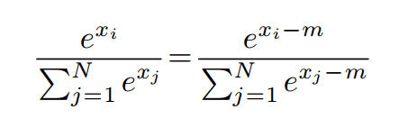

于是可以使用下面这个伪代码实现：

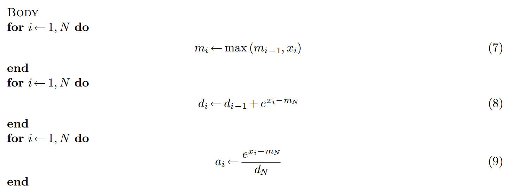

$x$是由$QK^T$计算的pre-softmax logits。如果我们没有足够大的SRAM来保存pre-softmax logits（显存需求为$O(N^2)$），就需要访问$Q$和$K$三次，并实时重新计算$x$，对于访存IO来说，这样是非常低效的。

### **Online Softmax:** 2-pass

上面的公式(7)(8)(9)中能否fuse为更少的计算呢？我们看(7)(8)这两个公式，能否利用动态规划的思想减少一次loop呢？

我们定义$d_{i}^{'}=\sum_{j=1}^{i} e^{x_j-m_i}$，其中$m_i$是$\{x_1,x_2...x_i \}$中的最大值。有$d_N=d_{N}^{'}$。

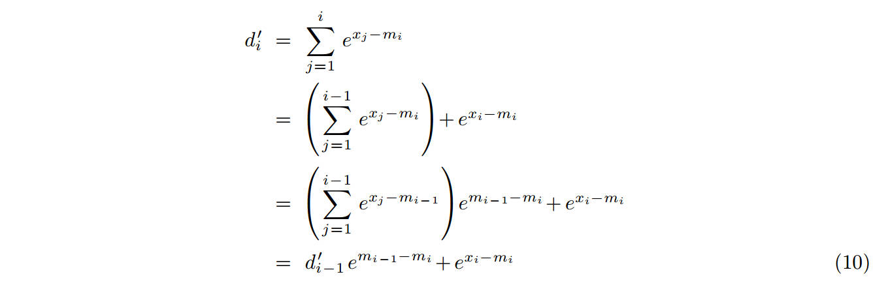

然后伪代码如下：
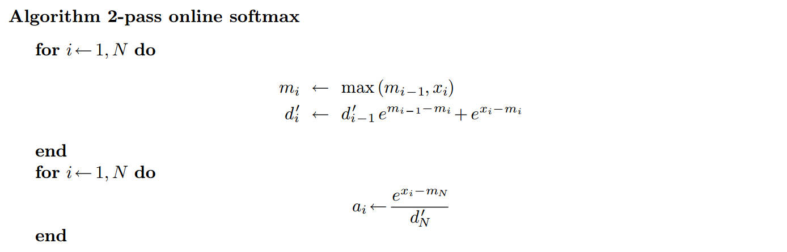

这是Online-Softmax的算法实现，但是它仍然需要2个loop的计算，我们能否继续优化为1个loop的计算呢。但是softmax是没有这种1 phase的方法的，但我们的目标并不是计算attention score矩阵$A$，而是计算最终的输出$O$，而这是可以1 phase计算的。

## FlashAttention

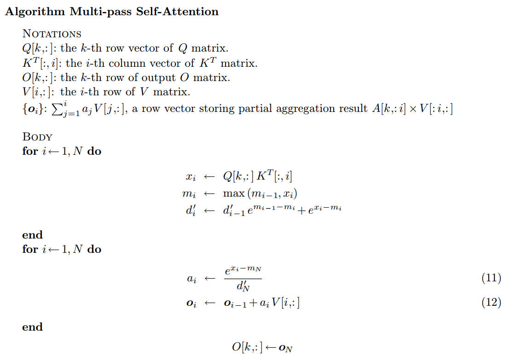

能否把这个过程压缩成1个phase呢。我们还是使用上面的动态规划思想，定义一个临时的状态$o_{i}^{'}$。

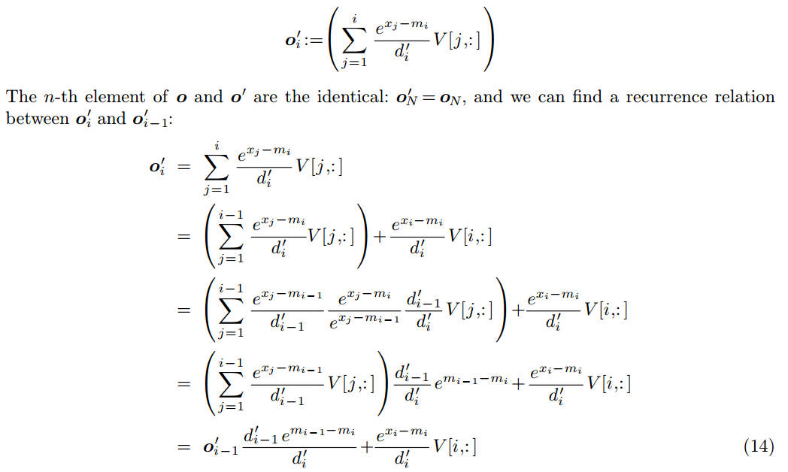

所以我们可以把上面的2个phase再压缩成1个phase：

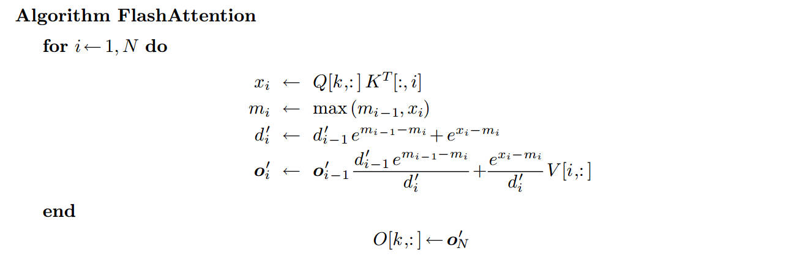

这个版本可以扩展为tiling的版本。

$Q,K \in R^{N\times d}, K^T \in R^{d \times N}$

* $b$是一个tile的size
* $\#tiles$是$K^T$一行的tiles数量，$N=b \times\#tiles$
* $x_i$：存储第$i$个tile的$Q[k]K^T$的值
* $m_i^{(local)}$：向量$x_i$中的局部最大值

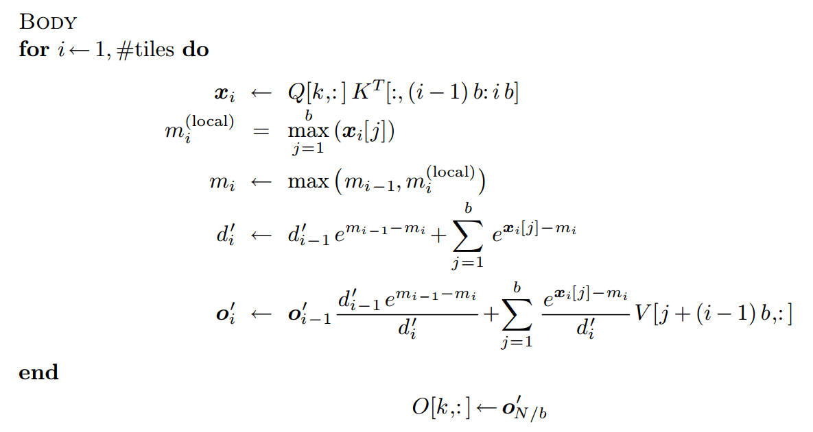

如下图所示。

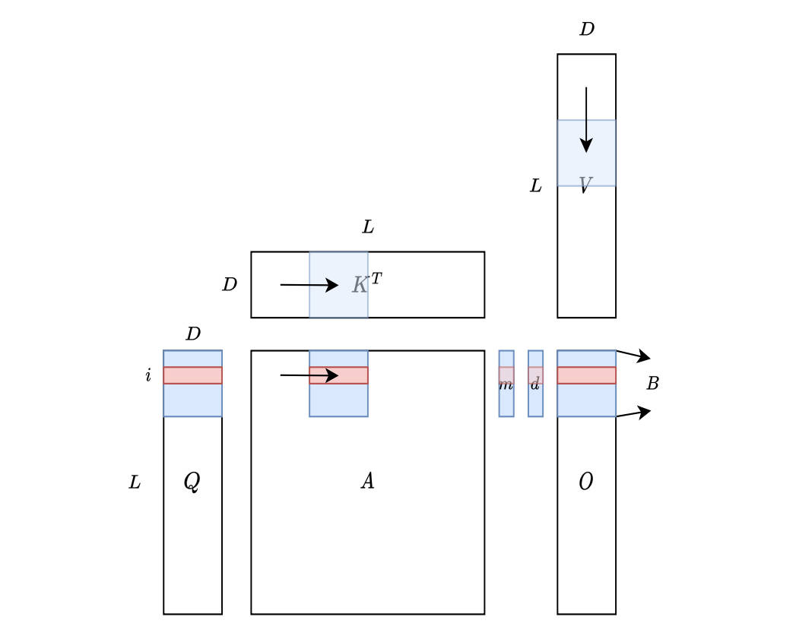

我们来看FlashAttention论文的实现。

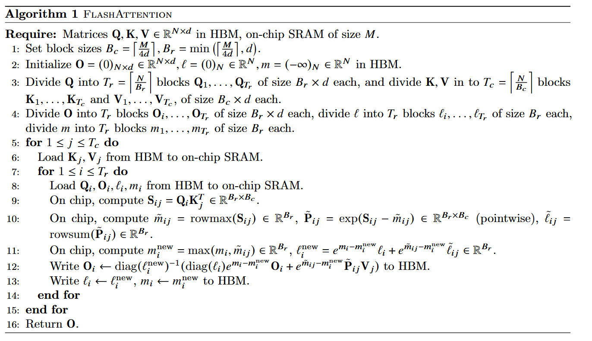

这里diag是对角矩阵。我们看伪代码的第12行和上面$o_i$的推导是一模一样的。

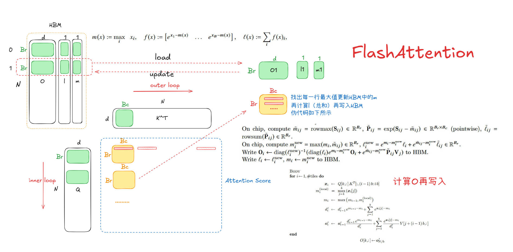