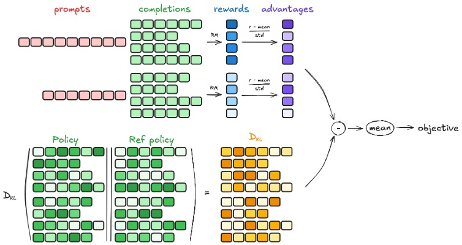
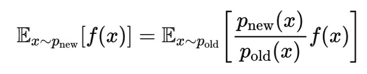

## GRPO

下面是GRPO的核心公式：

其中$\hat{A_{i,t}} = \frac{r_i - mean(r)}{std(r)}$，$r={r_1,r_2,...r_G}$。

重要性采样：

公式一个核心的就是概率比$\frac{\pi_\theta(o_{i,t} | q, o_{i,<t})}{\pi_{old}(o_{i,t} | q, o_{i,<t})}$，这个也叫重要性权重。

为什么要从old model中进行取样呢？

> 因为强化学习一般使用on-policy策略，也就是数据来源于我们被优化的模型，但这样需要每一次更新被优化的模型需要重新生成新的数据。如果使用old model生成的数据就可以重复利用这些数据，这个也叫off-policy。

完整的流程如下：

1. 把prompt输入old model生成 G 条response

2. 每条完整的response进行打分，并计算优势函数 A

3. 把response分别输入到policy model和old model中进行一次forward，得到每个token的概率

4. 计算per-token KL散度，再相加

