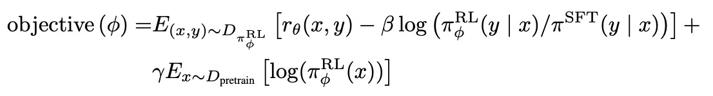
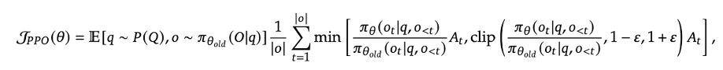
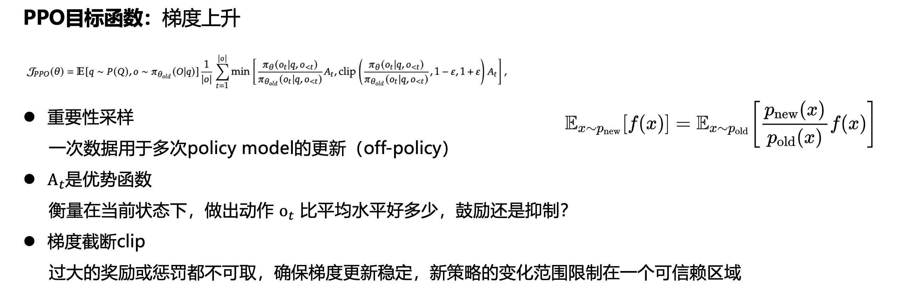
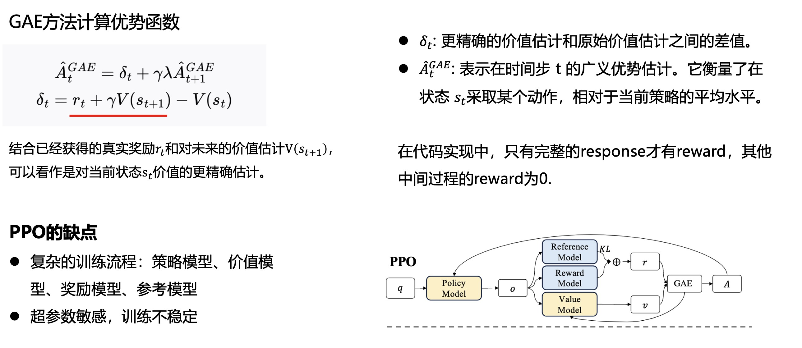

## PPO详解

在InstructGPT中，我们要优化下面的目标函数。

目标函数的意义：

1. 最大化奖励

2. KL散度，不要离最初的SFT模型太远，避免过度优化

3. 梯度混合，避免忘记在预训练阶段学到的通用语言知识

数据来源于我们需要优化的模型，也就是上面的$(x,y) \in D_{\pi_\phi^{RL}}$，但是这种on-policy的策略有一个明显的问题，就是在训练RL模型每进行一步更新的时候，需要重新使用更新后的模型生成数据，这样做不到数据的重复使用。

所以为了解决这个问题，使用PPO强化学习算法进行优化。

