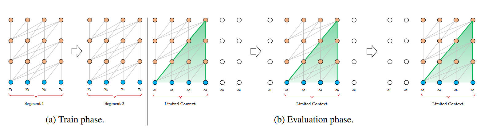
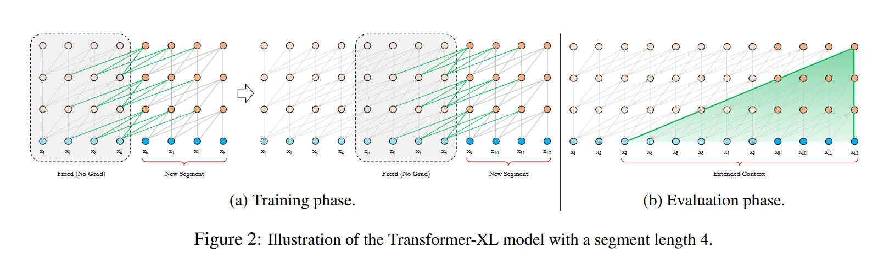
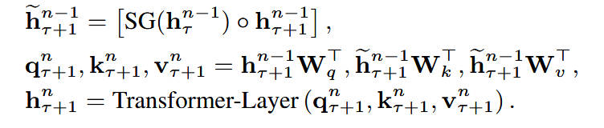
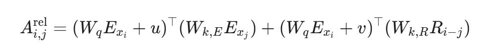

## Vanilla Transformer
在训练transformer这一类架构的时候需要一个上下文长度。如果文本序列长度短于固定长度，可以通过填充的方式来解决。如果序列长度超过固定长度，就是将文本划分为多个segments。训练的时候，对每个segment单独处理，segments之间没有联系，但这样有明显的缺点：
1. 因为segments之间独立训练，所以不同的token之间，最长的依赖关系，就取决于segment的长度
2. 出于效率的考虑，在划分segments的时候，不考虑句子的自然边界，而是根据固定的长度来划分序列，导致分割出来的segments在语义上是不完整的。

同样在进行预测的时候效率也很低。对固定长度的segment做计算，一般取最后一个位置的隐向量作为输出。为了充分利用上下文关系，在每做完一次预测之后，就对整个序列向右移动一个位置，再做一次计算，如上图(b)所示。

## Transformer-XL

为了解决上面提到的问题，在Trm的基础上，Trm-XL提出了一个改进，在对当前segment进行处理的时候，缓存并利用上一个segment中所有layer的隐向量序列，而且上一个segment的所有隐向量序列只参与前向计算，不再进行反向传播，这就是所谓的segment-level Recurrence。

Query (q) 只来自当前段（长度 L）。Key (k) 和 Value (v) 来自拼接后的序列（长度 L+M），核心计算量大致是 L * (L+M)，而不是 (L+M)^2。

## 相对位置编码

