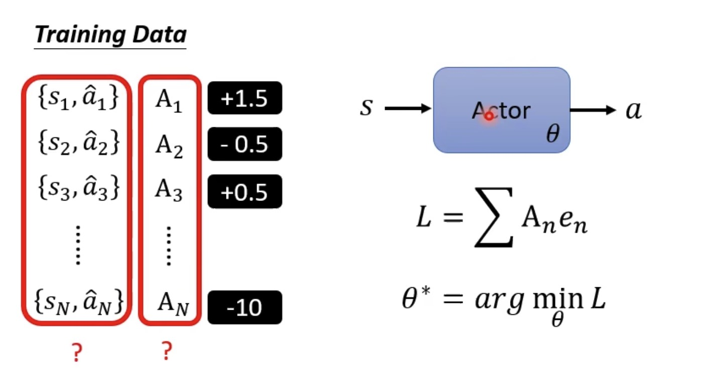
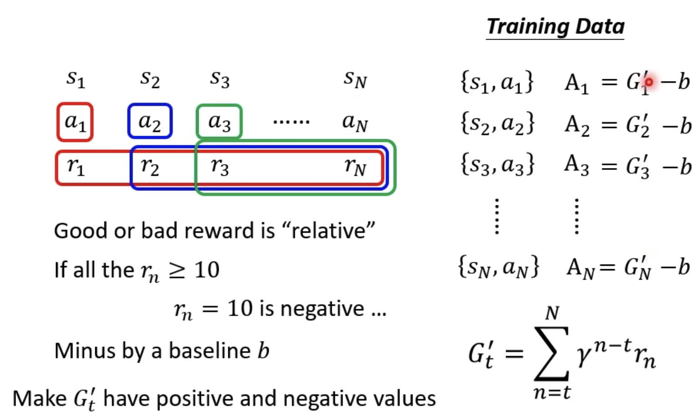
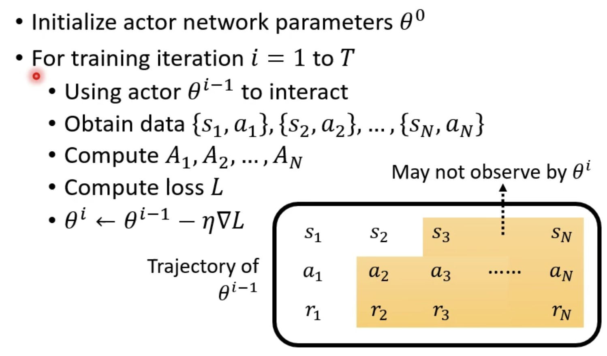

## 强化学习基础知识

$G_t$是一条具体路径选择上所能获得的回报总共回报，也叫return。由于策略（Policy）本身可能是随机的，环境的状态转移也可能是随机的，每次从相同状态走出的路径可能不同，因此每次计算出的 $G_t$ 的值也可能不同。
$$
G_t = R_{t+1} + γR_{t+2} + γ^2R_{t+3} + ...
$$
$V(s)$（状态价值函数）是一个期望，从状态 $s$ 出发，遵循策略 $\pi$ 无数次，会产生不同的路径，也就会有不同的 $G_t$ 值。把所有这些 $G_t$ 的值取平均，得到的结果就是 $V^\pi(s)$。它代表了状态 $s$ 的长期平均价值。
$$
V(s) = E[G_t | S_t = s]
$$
$Q(s,a)$也是一个期望，在状态 $s$ 中，执行动作 $a$，然后遵循策略 $π$ 继续与环境交互，所能获得的期望回报。
$$
Q(s,a) = E[G_t | S_t = s, A_t = a]
$$
$V(s)$与$Q(s,a)$有以下关系：
$$
V(s) = \sum_{a \in A} \pi(a | s) Q(s,a)
$$
$A(s,a)$是优势函数，表示在当前状态 $s$ 下，采取动作 $a$ 这个选择，比平均水平（即遵循当前策略的常规表现）好多少。
$$
A(s,a)=Q(s,a)−V(s)
$$

- 如果 $A(s, a) > 0$，说明动作 $a$ 比当前策略的平均水平要好，我们应该增加选择这个动作的概率。
- 如果 $A(s, a) < 0$，说明动作 $a$ 比平均水平差，我们应该降低选择它的概率。
- 如果 $A(s, a) ≈ 0$，说明这个动作不好不坏，影响不大。

**GAE**计算优势函数$A$：
$$
\hat A_t^{GAE} = \delta_t + \gamma \lambda \hat A_{t + 1}^{GAE} \\
\delta_t = r_t + \gamma V(s_{t+1}) - V(s_t)
$$
如何理解？
$ r_t + \gamma V(s_{t+1}) $可以看作是对当前状态 $s_t$ 价值的一个更精确的估计。它结合了已经获得的真实奖励 $r_t$ 和对未来状态价值的估计 $V(s_{t+1}) $。这个组合通常比单纯的 $V(s_t)$ 要更可靠，因为它至少包含了一步的真实信息。

所以，$\delta_t$ 计算的是 **更精确的价值估计** 和 **原始价值估计** 之间的差值。这个差值 $\delta_t$ 直观地告诉我们：我们最初对 $V(s_t)$ 的估计是偏高了还是偏低了。

$ \hat A_t^{GAE} $ 表示在时间步 $t$ 的广义优势估计。它衡量了在状态 $s_t$ 采取某个动作，相对于当前策略的平均水平，有多大的优势。$\gamma$ 是折扣因子。$\lambda$是 GAE 中最关键的参数，取值范围也是 [0, 1]。它用于在 偏差（bias） 和 方差（variance） 之间进行权衡。

$$
A_t^{GAE}=δt+γλA_{t+1}^{GAE} \\ 
=δ_t + γλ (δ_{t+1}+γλA_{t+2}^{GAE}) \\
=δ_t+γλδ_{t+1} + (γλ)^2 δ_{t+2} + …
$$
最终，它可以被写成一个所有未来 TD 误差的加权和：
$$
A_t^{GAE}=\sum_{k=0}^{\infty}( {\gamma \lambda})^k \delta_{t+k}
$$

当 $λ=0$ 时：

$A_t^{GAE}=δt=r_t+γV(s_{t+1})−V(s_t)$。

这时，GAE 就退化成了最简单的 **单步 TD 优势估计**。这种估计方差很低（因为它只依赖于下一步的随机性），但偏差可能很高，（因为它严重依赖于 $V(s_{t+1})$ 这个估计值的准确性，如果 $V$ 函数不准，偏差就很大）。

当 $λ=1$ 时：

$A_t^{GAE} = \sum_{k=0}^{\infty} \gamma^k \delta_{t+k}$

这等价于计算 **蒙特卡洛（Monte Carlo）** 优势估计。它会计算从当前时刻 t 开始，直到整个回合（episode）结束的真实回报，然后减去价值估计 $V(s_t)$。这种估计是无偏的（因为它使用了大量的真实奖励），但方差非常高（因为回报路径上的每一步都充满了随机性，导致结果波动很大）。

**在训练中如何计算呢**

在很多现实世界的强化学习任务中，一个episode可能会非常长，甚至是无限的。可以采用了一种更实用的方法：从环境中收集一个固定长度（例如N=2048步）的数据块，然后在这个数据块上计算GAE。

1. 收集数据： 智能体与环境交互，收集一个固定长度为 N 的轨迹数据$(s0,a0,r0),(s1,a1,r1),…,(s_{N−1},a_{N−1},r_{N−1})$和最后一个状态 $s_N$。
2. 反向计算GAE：有了这 N 步的数据和终点价值 $V(s_N)$（或者0），我们就可以 从后往前 递推计算出这个数据块里每一步的GAE值了。

