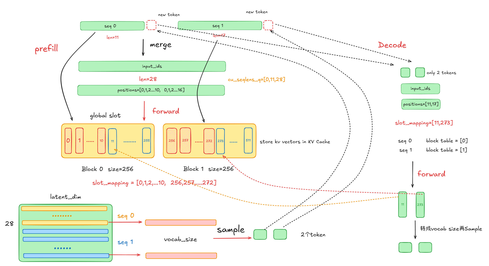

## Prefiil

介绍一下`nano-vllm`的调用链。假设这里有两个请求，一个prompt长度为11，一个prompt长度为17。

`llm_engine.generate()`会不断地调用`llm_engine.step()`函数，继续会调用`model_runner.run()`函数。

```python
    def run(self, seqs: list[Sequence], is_prefill: bool) -> list[int]:
        input_ids, positions = self.prepare_prefill(seqs) if is_prefill else self.prepare_decode(seqs)
        temperatures = self.prepare_sample(seqs) if self.rank == 0 else None
        logits = self.run_model(input_ids, positions, is_prefill)
        token_ids = self.sampler(logits, temperatures).tolist() if self.rank == 0 else None
        reset_context()
        return token_ids
```

在这里，因为两个序列长度分别为11和17，这里的`prepare_prefill()`函数会将两个请求**合并成一个长序列**。

>* `input_ids`为这28个token的id值（一维）
>
>* `positions`则是[0,1,2,...9,10, **0**,1,2,...15,16]，用于后面的位置编码。
>
>* `cu_seqlens_q`和`cu_seqlens_k`则是[0,11,28]，分别表示每一个序列第一个token起始位置。
>
>* `slot_mapping`为[0,1,2...9,10, **256**,257,...271,272]，表示每一个token的kv缓存向量的全局slot id，一个Block有256个kv缓存向量。

其中后三个变量是全局上下文`Context`，主要用于实现PageAttention算子（如何在kv cache中快速索引相应的kv向量）。

然后输入给模型进行一次前向计算，得到所有token的logits，这里是[28,latent_dim]，也计算得到了所有token的kv向量。然后获取每一个序列最后一个token的输出向量（通过上面保存的全局`Context`状态），通过一个输出头映射为`vocab_size`维度向量。

```Python
def forward(self, x: torch.Tensor):
    context = get_context()
    if context.is_prefill:
        last_indices = context.cu_seqlens_q[1:] - 1
        x = x[last_indices].contiguous()
    logits = F.linear(x, self.weight)
    if self.tp_size > 1:
        all_logits = [torch.empty_like(logits) for _ in range(self.tp_size)] if self.tp_rank == 0 else None
        dist.gather(logits, all_logits, 0)
        logits = torch.cat(all_logits, -1) if self.tp_rank == 0 else None
    return logits
```

在`model_runner.run()`函数内，然后使用`Sampler`进行一次采样token，然后通过`Scheduler.postprocess()`更新每一个sequence的状态。

最后`reset_context()`清空全局的上下文信息。


## Decode

在Decode时，输入模型进行前向的数据每一个sequence只需要1个token。接着分析上面的情况，在第一次进行decode的时候（`prepare_decode()`函数）。

>* `input_ids`为上一轮新生成的两个token id
>* `positions`为[11,17]
>* `slot_mapping`为[11, 273]


Decode阶段不需要更新 `cu_seqlens_q` 和 `cu_seqlens_k` ，因为所有序列的查询（Query）长度都是固定且统一的，永远为 1。

每一个sequence都有一个`block_table`，在decode的时候，会把所有的`block_table`转成一个统一长度的tensor。

> 假设 `max_len` 是 5。一个 `block_table` 是 `[10, 25, 3]` (长度为 3)，处理后变成 `[10, 25, 3, -1, -1]`。另一个 `block_table` 是 `[101, 78, 5, 9, 11]` (长度为 5)，处理后保持不变。

接下来的操作和上面的差不多，这里就不过多赘述。


## 总结


