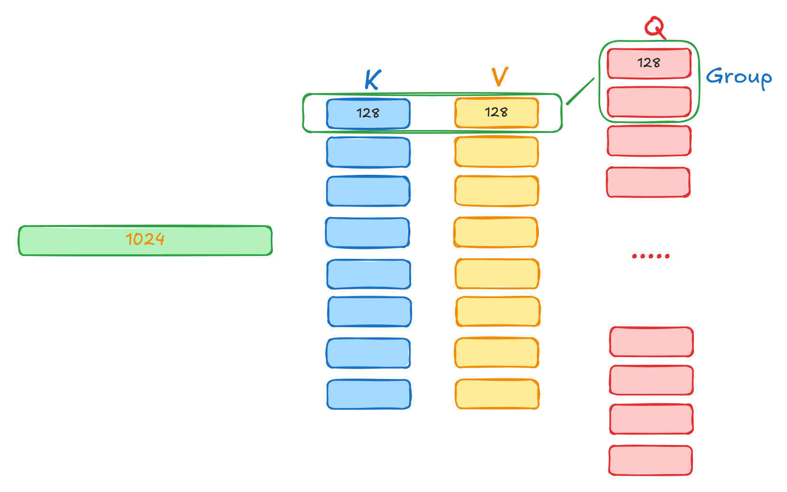
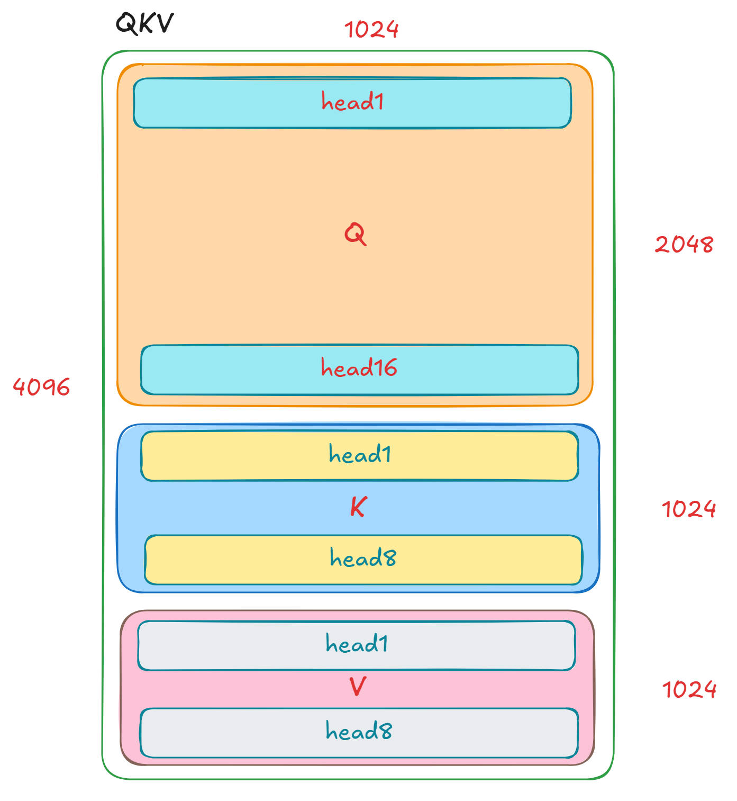
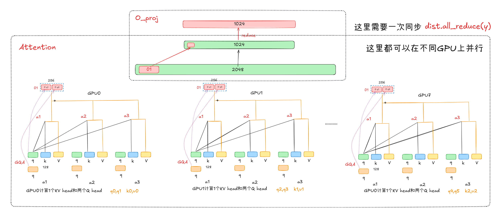

## 张量并行

nano-vllm中使用的并行策略是张量并行。每块GPU得到完整的输入数据，但是只使用部分的模型权重，然后再需要同步的时候使用`All-Reduce`操作。这里张量并行主要是针对heads的。比如说如果有8个KV heads和16个Q heads（GQA），8块GPU，那么每块GPU负责1个KV heads和2个Q heads的计算。然后在注意力层中需要计算输出o的时候进行`All-Reduce`。

在`model_runner`的初始化时，需要调用`load_model(self.model, config.model)`函数，这个加载模型的函数最重要的代码如下，主要是调用模型各层定制好的`weight_loader`函数。

```Python
param = model.get_parameter(param_name)
weight_loader = getattr(param, "weight_loader")
weight_loader(param, f.get_tensor(weight_name), shard_id)
```

我们下面来看一下`QKVParallelLinear`参数的加载。

```Python
    def weight_loader(self, param: nn.Parameter, loaded_weight: torch.Tensor, loaded_shard_id: str):
        param_data = param.data
        assert loaded_shard_id in ["q", "k", "v"]
        if loaded_shard_id == "q":
            shard_size = self.num_heads * self.head_size
            shard_offset = 0
        elif loaded_shard_id == "k":
            shard_size = self.num_kv_heads * self.head_size
            shard_offset = self.num_heads * self.head_size
        else:
            shard_size = self.num_kv_heads * self.head_size
            shard_offset = self.num_heads * self.head_size + self.num_kv_heads * self.head_size
        '''
            Q 矩阵    [2048, 1024]  16 heads   128 
            K V 矩阵  [1024, 1024]  8  heads   128
            tp_dim = 0
            
            GPU0  Q_0=[:256, 1024]        256维度是2个head
                  KV_0=[:128, 1024]       128维度是1个head
            q = X * Q_0^T  ->   [256]计算得到2个heads
            k = X * K_0^T  ->   [128]计算得到1个head
        '''
        param_data = param_data.narrow(self.tp_dim, shard_offset, shard_size)
        loaded_weight = loaded_weight.chunk(self.tp_size, self.tp_dim)[self.tp_rank]
        param_data.copy_(loaded_weight)
```

首先来解释一下这里这里的QKV参数矩阵。这里使用了GQA技术，`head_dim=128`，KV有8个head，Q有16个head，2个Q head共享一个KV head。所以这里的Q矩阵把输入向量从1024维映射为2048维，KV矩阵把输入向量1024维映射成1024维保持不变。

> 在 PyTorch 的 `torch.nn.Linear(in_features, out_features)` 模块中，权重张量 `weight` 的形状被定义为 `(out_features, in_features)`，也就是$y=xW^T+b$。



假设在8块GPU上进行并行，那么每一块GPU需要处理1个KV head和2个Q head，也就是需要把这里相应的QKV权重加载好。对于1块GPU，它的KV映射中，输入维度还是1024，但是输出维度是128，所以这里的权重张量维度为[128, 1024]，相似的，单个GPU的Q权重张量维度为[256, 1024]。因为在这里，模型把这些QKV权重矩阵打包在一起，所以`param_data`张量维度为[2048+1024+1024, 1024]，也就是[4096, 1024]。



我们看上面的代码中，首先计算`shard_size`，也就是上面的Q/K/V权重矩阵的大小，然后再计算`shard_offset`，也就是Q/K/V权重矩阵在这个大权重矩阵中的偏移位置。


## ParallelLinear

其实上面还有一个问题，这个模型权重是如何加载的呢，每一个GPU只需要加载一部分的模型权重而非全部，所以我的理解是这里需要重写一个并行的模型类，这个类的权重大是模型大小的$\frac{1}{world\_size}$。

```Python
       # Qwen3Attention  
       self.qkv_proj = QKVParallelLinear(
            hidden_size,
            self.head_dim,
            self.total_num_heads,
            self.total_num_kv_heads,
            bias=qkv_bias,
        )
        self.o_proj = RowParallelLinear(
            self.total_num_heads * self.head_dim,
            hidden_size,
            bias=False,
        )
```

`QKVParallelLinear`这个类继承`ColumnParallelLinear`这个类，而`ColumnParallelLinear`这个类继承`LinearBase`这个类。

```Python
class LinearBase(nn.Module):

    def __init__(
        self,
        input_size: int,
        output_size: int,
        bias: bool = False,
        tp_dim: int | None = None,
    ):
        super().__init__()
        self.tp_dim = tp_dim
        self.tp_rank = dist.get_rank()
        self.tp_size = dist.get_world_size()
        self.weight = nn.Parameter(torch.empty(output_size, input_size))
        self.weight.weight_loader = self.weight_loader
        if bias:
            self.bias = nn.Parameter(torch.empty(output_size))
            self.bias.weight_loader = self.weight_loader
        else:
            self.register_parameter("bias", None)

    def forward(self, x: torch.Tensor) -> torch.Tensor:
        raise NotImplementedError
```

然后我们看：

```Python
class ColumnParallelLinear(LinearBase):

    def __init__(
        self,
        input_size: int,
        output_size: int,
        bias: bool = False,
    ):
        tp_size = dist.get_world_size()
        super().__init__(input_size, divide(output_size, tp_size), bias, 0)
```

这里它调用了`super().__init__(input_size, divide(output_size, tp_size), bias, 0)`，也就是对于每一个GPU，它的`input_size`都是一样的，也就是输入序列的维度，而它的输出就是`output_size/tp_size`。这也就都说的通了，每一块GPU仅有模型的部分权重。

### 在哪里进行同步？

一图胜千言：



这里上面的`Qwen3Attention`的计算中，主要体现的是下面这两个组件。

```Python
self.qkv_proj = QKVParallelLinear(
	hidden_size,
    self.head_dim,
    self.total_num_heads,
    self.total_num_kv_heads,
    bias=qkv_bias,
)
self.o_proj = RowParallelLinear(
	self.total_num_heads * self.head_dim,
    hidden_size,
    bias=False,
)
```

其中`QKVParallelLinear`继承自`ColumnParallelLinear`类，那么`RowParallelLinear`和`ColumnParallelLinear`有什么区别呢。

**ColumnParallelLinear(列并行)**

这个类通过**垂直地（沿着列）**切分权重矩阵来实现并行。

- **切分方式**：假设你有一个尺寸为 `[input_size, output_size]` 的权重矩阵 `W`。`ColumnParallelLinear` 会将其垂直地切分成 `N` 份（`N` 是张量并行的GPU数量），因此每个 GPU 只持有尺寸为 `[input_size, output_size / N]` 的权重分片。

* 在前向传播中**不需要任何通信**（比如 `all_reduce`）。输出 `y` 保持着分片的状态，通常会直接输入到下一个可以处理分片数据的操作中。如图，上面的各个head的输出计算不需要进行通信。

**RowParallelLinear(行并行)**

这个类通过**水平地（沿着行）**切分权重矩阵来实现并行。

- **切分方式**：对于一个尺寸为 `[input_size, output_size]` 的权重矩阵 `W`，`RowParallelLinear` 会将其水平地切分成 `N` 份，因此每个 GPU 只持有尺寸为 `[input_size / N, output_size]` 的权重分片。

* 它期望接收的输入张量 `x` 是一个**已经被切分过的、部分的数据**（通常是前一个并行操作的输出）。在它自己的输入分片上执行一次本地的线性运算。这个运算在每个 GPU 上都会产生一个**部分结果**。最关键的一步是，它会执行一次 `dist.all_reduce(y)` 操作。这个操作会**将所有 GPU 上的部分结果求和**，从而在**每个 GPU 上都得到一个完整的、完全相同的最终输出张量**。


## KV Cache在哪里？

`model_runner`会调用`allocate_kv_cache`函数，在这里计算GPU上可用的显存，并把其赋值给每一Attention层的KV Cache中。

```Python
def allocate_kv_cache(self):
    config = self.config
    hf_config = config.hf_config
    free, total = torch.cuda.mem_get_info()
    used = total - free
    peak = torch.cuda.memory_stats()["allocated_bytes.all.peak"]
    current = torch.cuda.memory_stats()["allocated_bytes.all.current"]
    num_kv_heads = hf_config.num_key_value_heads // self.world_size
    block_bytes = 2 * hf_config.num_hidden_layers * self.block_size * num_kv_heads * hf_config.head_dim * hf_config.torch_dtype.itemsize
    config.num_kvcache_blocks = int(total * config.gpu_memory_utilization - used - peak + current) // block_bytes
    assert config.num_kvcache_blocks > 0
    self.kv_cache = torch.empty(2, hf_config.num_hidden_layers, config.num_kvcache_blocks, self.block_size, num_kv_heads, hf_config.head_dim)
    layer_id = 0
    for module in self.model.modules():
        if hasattr(module, "k_cache") and hasattr(module, "v_cache"):
            module.k_cache = self.kv_cache[0, layer_id]
            module.v_cache = self.kv_cache[1, layer_id]
            layer_id += 1
```

`kv_cache`张量的维度为`[2, 模型多少层, 共有多少个block, blocksize=256（slot）, 每块GPU分配的heads number, head_dim]`。

