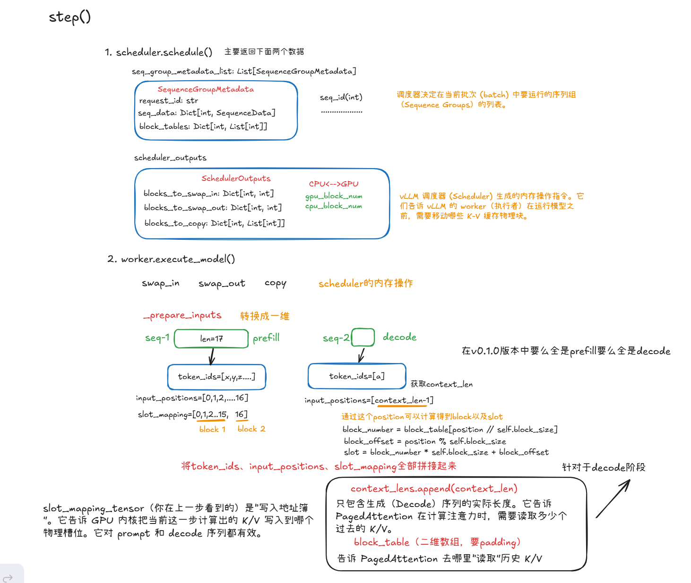
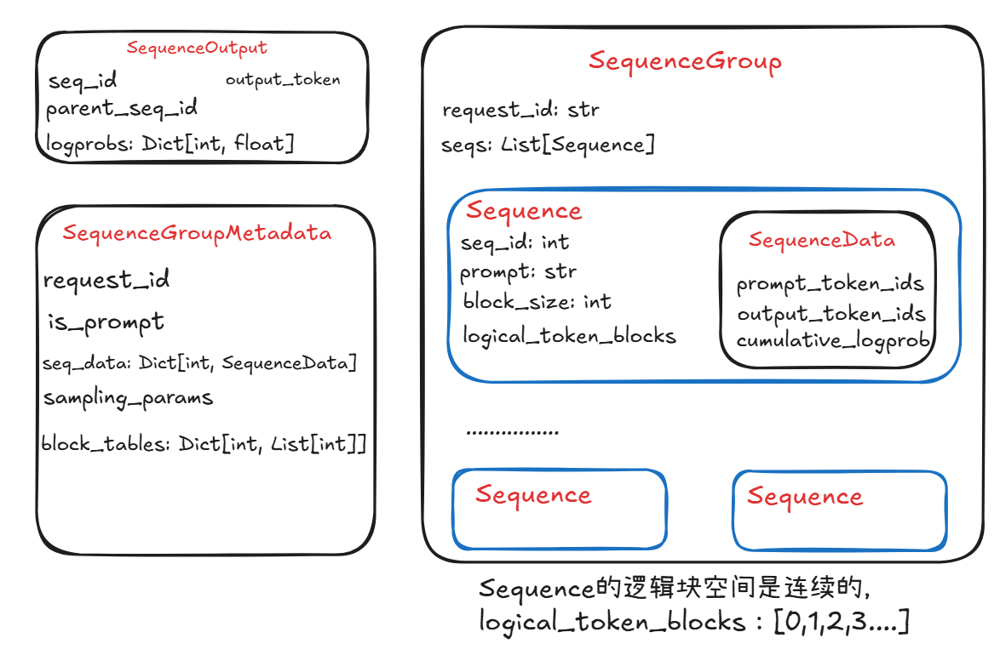

## Step函数




## SequenceGroup

我们先来认识一下`SequenceGroup`，为什么需要这个呢？在一些场景下，模型sample的策略会有一些复杂。比如说**Parallel Sampling**和**Beam Search**。可能出现1个prompt -> 多个outputs的情况，`SequenceGroup`就是为了解决这个问题。



再看上面的`step`函数，首先`scheduler.schedule()`得到`seq_group_metadata_list`，这是需要进行前向计算（放入running队列）中的seq_group元数据信息。这里只会选取一个`SequenceGroup`中状态为Running的seq放入`seq_group_metadata`中，因为有的seq可能已经生成完全部token了。

然后`execute_model`中，先调用`_prepare_inputs`函数，它会把参数组织成`InputMetaData`传入model.forward函数中。这里的`InputMetaData`是不是针对于每一个`SequenceGroup`的，而是针对于其下每一条`Sequence`的。

```python
class InputMetadata:

    def __init__(
        self,
        seq_groups: List[Tuple[List[int], SamplingParams]],     # List of (seq_ids, sampling_params).
        seq_data: Dict[int, SequenceData],                      # Seq_id -> SequenceData.
        prompt_lens: List[int],
        slot_mapping: torch.Tensor,
        context_lens: torch.Tensor,
        max_context_len: int,
        block_tables: torch.Tensor,
    ) -> None:
```


## Beam Search

在上面的`step`函数中，会执行`execute_model`得到`seq_outputs: Dict[int, SequenceOutputs]`这个结果，接下来需要对Running队列中的seq_group进行更新，这里的逻辑在`scheduler.update()`这个函数。

```python
    def update(
        self,
        seq_outputs: Dict[int, SequenceOutputs],
    ) -> List[SequenceGroup]:
        # Update the running sequences and free blocks.
        for seq_group in self.running:
            # Process beam search results before processing the new tokens.
            for seq in seq_group.get_seqs(status=SequenceStatus.RUNNING):
                output = seq_outputs[seq.seq_id]
                if seq.seq_id != output.parent_seq_id:
                    # The sequence is a fork of the parent sequence (beam search).
                    # Free the current sequence.
                    self.block_manager.free(seq)
                    # Fork the parent sequence.
                    parent_seq = seq_group.find(output.parent_seq_id)
                    parent_seq.fork(seq)
                    self.block_manager.fork(parent_seq, seq)

            # Process the new tokens.
            for seq in seq_group.get_seqs(status=SequenceStatus.RUNNING):
                # Append a new token to the sequence.
                output = seq_outputs[seq.seq_id]
                seq.append_token_id(output.output_token, output.logprobs)
        # Return a shallow copy of the running queue to prevent the queue
        # from being modified by the caller.
        return self.running.copy()
```

通过这里的代码我们能了解Beam Search是如何实现的。


假设这里的束宽为2，running队列中一个`SequenceGroup`中有1个id=1的`Sequence`，另一个是id=2。

1. Prefill

   `_sample`函数会采样2个token，然后创建2个`SequenceOutput`，`seq_id`还是按照原来的顺序，`parent_seq_id`分别为1和2。这个过程的`update`相当于只是简单的append new token。

2. Decode

   这个过程`_sample`函数会为每一个seq采样2个token，于是得到了4个采样的结果。然后要基于概率进行筛选。假设这里筛选的全为seq_id=2产生的2个分支，于是这里的2个`SequenceOutput`的`parent_seq_id`全为2。在上面的`update`函数中，首先要判断是否有1个分支已经死亡了，在这里seq_id=1这个seq它已经全被剪枝了，取而代之的是parent_seq_id=2这个分支。所以首先需要把seq_id这个seq给``free`掉，然后再把parent_seq_id给`fork`一份。最后再append new token。


