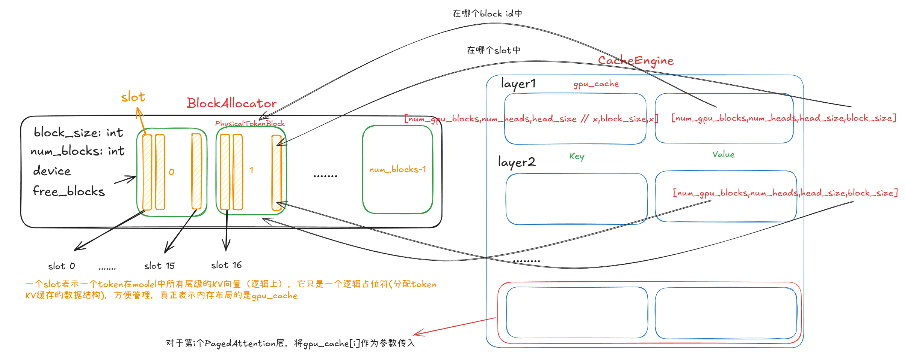
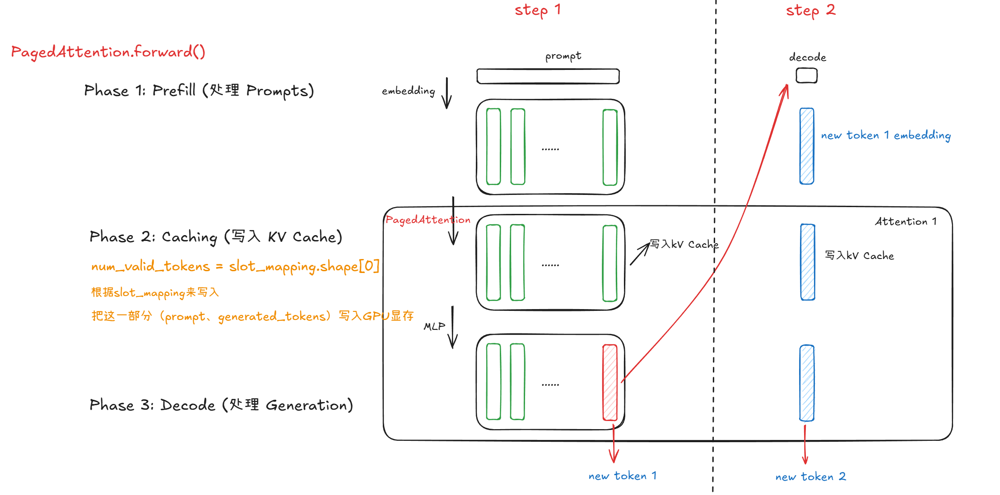
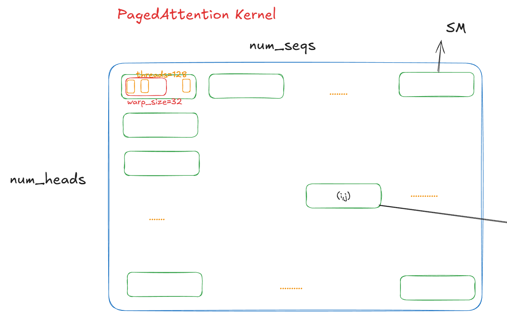
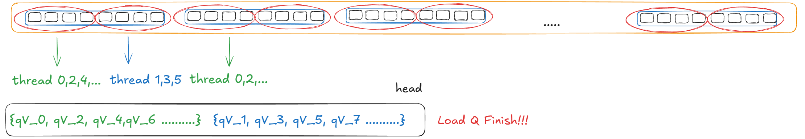
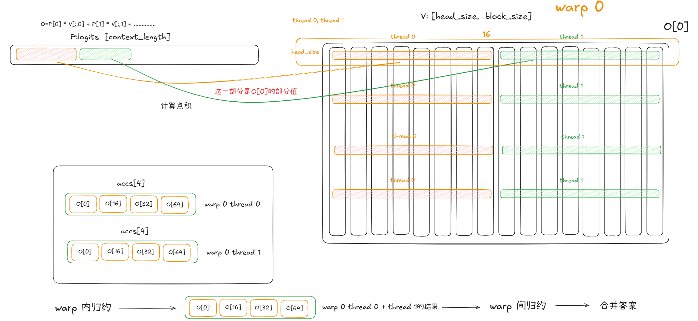

## PageAttention

前面讲了`step`函数，了解了PageAttention需要的输入参数，接下来就开始讲PageAttention的一些实现细节。在讲之前，可以稍微了解一下这里GPU Cache的管理。

```Python
    def allocate_gpu_cache(self) -> List[KVCache]:
        gpu_cache: List[KVCache] = []
        key_block_shape = self.get_key_block_shape()
        value_block_shape = self.get_value_block_shape()
        for _ in range(self.num_layers):
            key_blocks = torch.empty(
                size=(self.num_gpu_blocks, *key_block_shape),
                dtype=self.dtype,
                device="cuda",
            )
            value_blocks = torch.empty(
                size=(self.num_gpu_blocks, *value_block_shape),
                dtype=self.dtype,
                device="cuda",
            )
            gpu_cache.append((key_blocks, value_blocks))
        return gpu_cache
```



所以，在`forward`函数中，只需要把相应那层的kv cache传入。

```python
   		for i in range(len(self.layers)):
            layer = self.layers[i]
            hidden_states = layer(
                positions,
                hidden_states,
                kv_caches[i],
                input_metadata,
                cache_event,
            )
        hidden_states = self.norm(hidden_states)
        return hidden_states
```

现在进入了PagedAttention层，我们看它的`forward`过程。如果是Prefill过程，它会首先计算出output，然后再把key和value写入kv cache中，对于decode阶段也是一样，写入kv cache中token的个数由`slot_mapping`的长度决定。



下面我们讲解PageAttention的核心代码，会深入到cuda算子层面，首先来看decode过程的算子,下面是PageAttention中decode算子的入口，`block_tables`是一个[seq_num,max_table_len]的二维数组(填充后)，相当于传入了每一个sequence的逻辑地址空间，worker拿到这个逻辑地址空间后根据其信息进行地址的转换。`context_lens`是每一个sequence的上下文长度，和`max_context_len`共同确定decode过程需要往前看多少个kv向量。这里的`key_cache`和`value_cache`都是相应Attention层专属的cache，如上第一幅图所示。

```python
        attention_ops.single_query_cached_kv_attention(
            output,
            query,
            key_cache,
            value_cache,
            self.scale,
            input_metadata.block_tables,
            input_metadata.context_lens,
            block_size,
            input_metadata.max_context_len,
        )
```

接下来启动kernel,其中grid[num_heads, num_seqs]，block[128]，一个block中的128个线程负责一个sequence的某一个head的计算。



1. load Q

   一个线程第一步就是load q向量（某一个head），q的维度是[num_generation_tokens, num_heads, head_size]。这里有一个细节，一个线程组（2线程）一次读取16字节，假如一个元素是half类型（2字节），那么这里一个Vec是4个元素。奇数线程读取Vec的奇数索引部分，偶数线程读取Vec的偶数索引部分。

   

2. load K

   线程的下一步是去key cache中读取相关的key向量与q做内积，一个block要读取该条seq在当前head下所有的key向量，但是key向量在key cache中的位置是分散的（同一个block table中是连续的）。所以这里一个很自然的想法是block中的一个warp读取一个block table，比如warp size为4，那么`warp 0`读取`block_tables[0,4,8...]`。

   

   一个warp内的32个线程要处理一个key blocktable，key cache的内存组织为`[num_gpu_blocks,num_heads,head_size // x,block_size,x]`，所以下面的`k_ptr`首先定位到当前位置，也就是下图的位置。

   ```Python
           const scalar_t* k_ptr = k_cache + physical_block_number * num_heads * HEAD_SIZE * BLOCK_SIZE 
                                           + head_idx * HEAD_SIZE * BLOCK_SIZE
                                           + physical_block_offset * x;
   ```

   一个blocktable中有16个token的key向量，一个warp有32个线程，所以这里也进行了线程的分组，2个thread同时处理一个token。下面可以清晰地看到为什么要这样组织，是如何进行内存合并的。

   

3. QK dot

   接下来就进行QK的点积`qk`的计算，如上图，是以thread group为单位进行点积计算的，还需把`qk`的计算结果写入共享内存（Block内的共享内存`logits`）。。一个thread group计算q与一个token的k的点积。接下来需要找到`qk`的最大值（一个Block内），首先是进行warp内的归约，然后就是warp间的归约，最后一个Block中所有的线程都拿到了这个最大的`qk_max`。

   ```Python
   	  const float qk = scale * Qk_dot<scalar_t, THREAD_GROUP_SIZE>::dot(q_vecs, k_vecs);
         const bool mask = token_idx >= context_len;
       
         if (thread_group_offset == 0) {
           // Store the partial reductions to shared memory.
           // NOTE(woosuk): It is required to zero out the masked logits.
           logits[token_idx] = mask ? 0.f : qk;
           // Update the max value.
           qk_max = mask ? qk_max : fmaxf(qk_max, qk);
         }
   ```

   接下来就是进行softmax的计算，然后得到最后的`logits`，用于最后与Value相乘。

4. O=PV

   同样的逻辑从value cache中加载v向量，1个warp用于加载1个value cache block。

   > O = logits[0]\*V0 + logits[1]\*V1 + logits[2]\*V2 + ..........

   

   这里可以让一个thread group计算1个输出维度，最后再进行规约，然后将所有的维度拼接起来。


