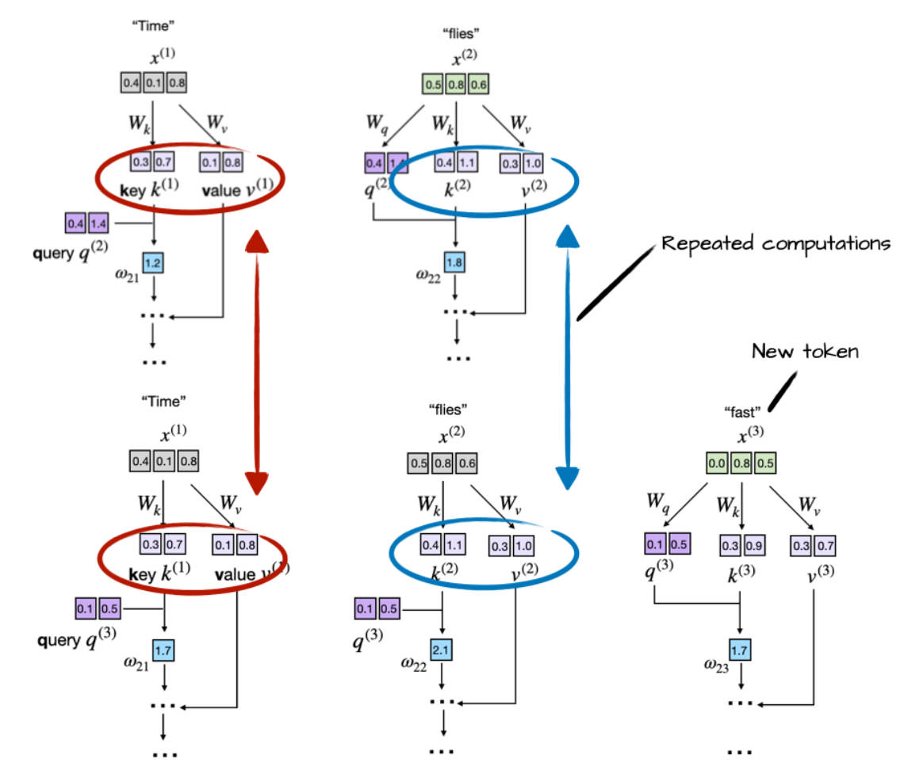

## KV Cache

在进行推理的时候可以使用KVCache。如上图所示，当我们给出“Time flies”的时候，我们只需要计算$x^{(2)}$的输出头来预测下一个token，假设这里得到“fast”，再把这个token输入到模型中，我们现在只需要使用$x^{(3)}$的输出头预测下一个token。我们看到其实这里的Key和Value是可以缓存起来的，也就可以减少重复的矩阵计算。
**所以在进行推理的时候，我们把计算过的key和value缓存起来，这样在进行推理的时候，我们每次只需要输入给模型计算上一轮新生成的token，计算这个token的q,k,v向量**，然后把它的k,v向量也添加到KVCache中，再把q矩阵同KVCache所有的的key向量进行点积运算，得到加权的系数，最后同所有的value向量加权求和，然后再把它作为输出头预测下一个token。

## 代码实现
直接上代码实现，这是一个比较简单的模型推理实现：
```Python
def generate_text_simple_cached(model, idx, max_new_tokens,
                                context_size=None, use_cache=True):
    model.eval()
    ctx_len = context_size or model.pos_emb.num_embeddings

    with torch.no_grad():
        if use_cache:
            # Init cache with full prompt
            model.reset_kv_cache()
            logits = model(idx[:, -ctx_len:], use_cache=True)

            for _ in range(max_new_tokens):
                # a) pick the token with the highest log-probability (greedy sampling)
                next_idx = logits[:, -1].argmax(dim=-1, keepdim=True)
                # b) append it to the running sequence
                idx = torch.cat([idx, next_idx], dim=1)
                # c) feed model only the new token
                logits = model(next_idx, use_cache=True)
```
我们看到，`logits = model(next_idx, use_cache=True)`，**模型推理的时候只把上一轮新生成的token输入给模型**，并没有把所有的token输入给模型。所以在进行推理并使用KVCache的情况下，输入x的序列长度是为1的。
在`GPTModel`中，要对输入的x进行位置编码，所以需要维护一个变量叫做`current_pos`，表示当前这个token的位置，然后为这个token进行位置编码。
```python
if use_cache:
    pos_ids = torch.arange(self.current_pos, self.current_pos + seq_len, device=in_idx.device, dtype=torch.long)
    self.current_pos += seq_len # 进行推理时这里长度为 1
    
pos_embeds = self.pos_emb(pos_ids).unsqueeze(0)
x = tok_embeds + pos_embeds  # Shape [batch_size, num_tokens, emb_size]
```
然后进行注意力计算，接下来看`MultiHeadAttention`。首先使用`register_buffer`注册KV缓存。
```python
self.register_buffer(
    "mask",
    torch.triu(torch.ones(context_length, context_length), diagonal=1),
    persistent=False
)

self.register_buffer("cache_k", None, persistent=False)
self.register_buffer("cache_v", None, persistent=False)
```
在`forward`方法中：
```python
 def forward(self, x, use_cache=False):
    b, num_tokens, d_in = x.shape

    keys_new = self.W_key(x)  # Shape: (b, num_tokens, d_out)
    values_new = self.W_value(x)
    queries = self.W_query(x)

    # We implicitly split the matrix by adding a `num_heads` dimension
    # Unroll last dim: (b, num_tokens, d_out) -> (b, num_tokens, num_heads, head_dim)
    keys_new = keys_new.view(b, num_tokens, self.num_heads, self.head_dim)
    values_new = values_new.view(b, num_tokens, self.num_heads, self.head_dim)
    queries = queries.view(b, num_tokens, self.num_heads, self.head_dim)


    if use_cache:
        if self.cache_k is None:
            self.cache_k, self.cache_v = keys_new, values_new
        else:
            self.cache_k = torch.cat([self.cache_k, keys_new], dim=1)
            self.cache_v = torch.cat([self.cache_v, values_new], dim=1)
        keys, values = self.cache_k, self.cache_v
    else:
        keys, values = keys_new, values_new
        ####################################################

    # Transpose: (b, num_tokens, num_heads, head_dim) -> (b, num_heads, num_tokens, head_dim)
    keys = keys.transpose(1, 2)
    queries = queries.transpose(1, 2)
    values = values.transpose(1, 2)

    # Compute scaled dot-product attention (aka self-attention) with a causal mask
    attn_scores = queries @ keys.transpose(2, 3)  # Dot product for each head

    ####################################################
    # NEW
    num_tokens_Q = queries.shape[-2]
    num_tokens_K = keys.shape[-2]
    if use_cache:
        mask_bool = self.mask.bool()[
            self.ptr_current_pos:self.ptr_current_pos + num_tokens_Q, :num_tokens_K
        ]
        self.ptr_current_pos += num_tokens_Q
    ####################################################
    # Original mask truncated to the number of tokens and converted to boolean
    else:
        mask_bool = self.mask.bool()[:num_tokens_Q, :num_tokens_K]

    # Use the mask to fill attention scores
    attn_scores.masked_fill_(mask_bool, -torch.inf)

    attn_weights = torch.softmax(attn_scores / keys.shape[-1]**0.5, dim=-1)
    attn_weights = self.dropout(attn_weights)

    # Shape: (b, num_tokens, num_heads, head_dim)
    context_vec = (attn_weights @ values).transpose(1, 2)

    # Combine heads, where self.d_out = self.num_heads * self.head_dim
    context_vec = context_vec.contiguous().view(b, num_tokens, self.d_out)
    context_vec = self.out_proj(context_vec)  # optional projection

    return context_vec
```


